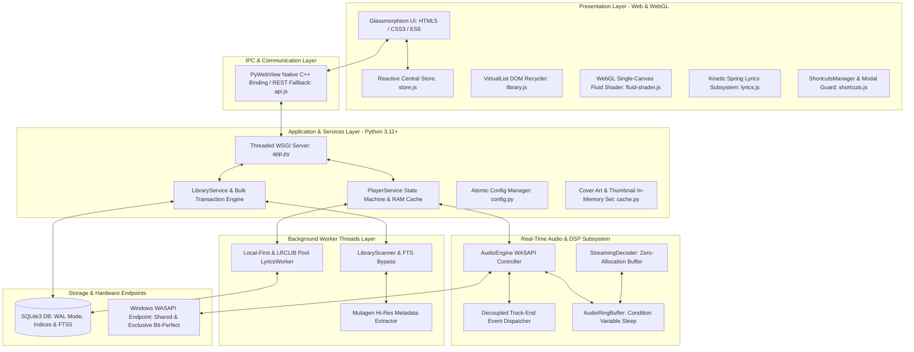
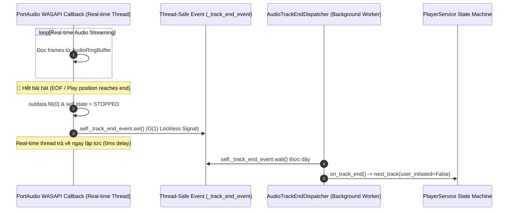
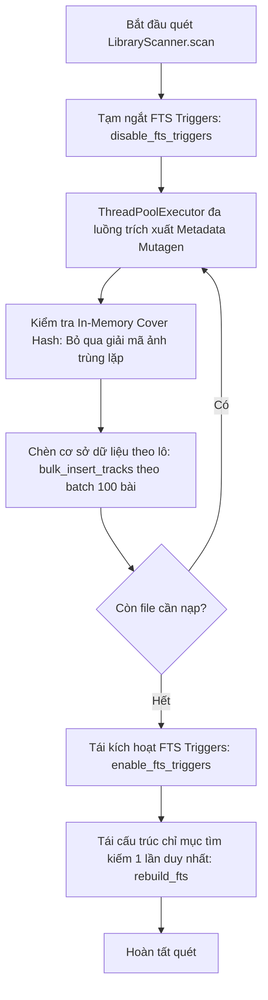

# ZFPlayer Architecture & Technical Specification Document

Tài liệu này mô tả chi tiết toàn diện kiến trúc kỹ thuật, mô hình luồng dữ liệu, 12 phân hệ cốt lõi (Core System Pipelines) và toàn bộ các tiêu chuẩn kỹ thuật chuyên sâu (Deep Technical Requirements) của **ZennyFLAC Player (ZFPlayer)**.

---

## 1. Tổng Quan Kiến Trúc (Architectural Overview)

ZFPlayer được xây dựng theo mô hình **Desktop lai Client-Server (Hybrid Desktop Architecture)** với sự phân tách trách nhiệm (Separation of Concerns) nghiêm ngặt giữa Giao diện người dùng (Presentation Layer), Lớp cầu nối bản địa (Native Bridge), Bộ điều khiển âm thanh C-level thời gian thực, Phân hệ đồ họa WebGL và Cơ sở dữ liệu SQLite tối ưu hóa:



---

## 2. Chi Tiết 12 Phân Hệ & Luồng Xử Lý Kỹ Thuật (12 Core System Pipelines)

### 2.1 Luồng Khởi Động & Gói Gộp Nạp Tức Thì (App Bootstrap Pipeline)
- **Module:** `backend/services/library_service.py`, `backend/app.py`, `frontend/js/api.js`, `frontend/js/main.js`.
- **Mục tiêu:** Giảm thiểu tối đa số lượng round-trip IPC khi mở ứng dụng từ trạng thái nguội (Cold Start).

#### Cơ chế hoạt động:
1. Khi PyWebView kích hoạt sự kiện `DOMContentLoaded`, `main.js` gọi phương thức gộp:
   ```javascript
   const bootstrap = await window.api.getBootstrapData();
   ```
2. Backend gom toàn bộ thông tin trong 1 lượt đọc bộ nhớ:
   - Cấu hình người dùng (`config`).
   - Trạng thái phát nhạc hiện thời (`player_state`).
   - Danh sách Playlist và ảnh bìa đại diện (`playlists`, `system_covers`).
   - Danh sách bài nghe gần đây (`recently_played`).
   - Tổng số lượng bài hát trong thư viện (`total_tracks`).
3. Frontend nhận 1 payload duy nhất và khởi tạo đồng loạt State Store, Slider Volume, Phím tắt, Danh sách bài hát mà không phải chờ đợi các IPC waterfall tuần tự.

---

### 2.2 Luồng Phát Âm Thanh Zero-Glitch & Tách Biệt GIL (Real-Time Audio Pipeline)
- **Module:** `backend/audio/engine.py`, `backend/audio/buffer.py`.
- **Mục tiêu:** Đảm bảo luồng callback âm thanh thời gian thực chạy ổn định 100% không bị đứng hay méo tiếng do Python GIL.



#### Kỹ thuật cốt lõi:
* **Zero-Allocation Callback**: Bên trong `_audio_callback`, tuyệt đối không thực hiện bất kỳ lệnh cấp phát bộ nhớ Heap (`malloc`/`PyObject_New`) hay khởi tạo `threading.Thread(...)`.
* **Asynchronous Signal Dispatcher**: Khi hết bài, callback chỉ kích hoạt cờ `_track_end_event.set()`. Một thread nền độc lập `_track_end_dispatcher` tiếp nhận sự kiện và gọi `on_track_end()` an toàn ngoài vùng realtime.

---

### 2.3 Phân Hệ Giải Mã Streaming & Vòng Đệm Không Cấp Phát (Streaming Decoder Pipeline)
- **Module:** `backend/audio/decoder.py`, `backend/audio/buffer.py`.
- **Mục tiêu:** Đọc file nhạc dung lượng lớn mà không tiêu tốn RAM và không gây áp lực lên bộ gom rác Garbage Collector.

#### Cơ chế hoạt động:
* **Pre-allocated Read Buffer**: Trong hàm `StreamingDecoder.load()`, mảng `self._read_buffer` (kích thước 4096 frames $\times$ channels dạng `float32`) được cấp phát sẵn 1 lần duy nhất.
* **Zero-Copy In-Place Slicing**: Trong vòng lặp giải mã `_decode_loop()`, SoundFile ghi trực tiếp vào slice của mảng có sẵn:
  ```python
  target_slice = self._read_buffer[:frames_to_read]
  read_data = self.sf_file.read(out=target_slice, dtype=self._read_dtype)
  ```
* **Circular Wrap-Around**: `AudioRingBuffer` xử lý việc ghi/đọc vòng qua 2 lát cắt `part1_size` và `part2_size` đồng thời đồng bộ hóa bằng `threading.Condition` để Decoder ngủ khi đệm đầy, loại bỏ 100% tình trạng Busy-Wait CPU.

---

### 2.4 Phân Hệ Phần Cứng WASAPI Dual-Engine (Hardware Output Pipeline)
- **Module:** `backend/audio/engine.py`, `backend/api/config_api.py`.
- **Chế độ hoạt động:**
  1. **WASAPI Exclusive (Bit-Perfect)**:
     - Khởi tạo stream với `sd.WasapiSettings(exclusive=True)`.
     - Bỏ qua toàn bộ bộ trộn Windows System Mixer (`audiodg.exe`), khóa cứng sample rate của card âm thanh theo file gốc (44.1kHz, 96kHz, 192kHz).
     - Truyền 100% bit nguyên bản đến DAC cao cấp.
  2. **WASAPI Shared**:
     - Stream âm thanh đi qua Windows Audio Engine để người dùng vừa nghe nhạc vừa chơi game, xem video.
  3. **Auto-Recovery & Safe Fallback**:
     - Tự động bắt lỗi thiết bị ngắt kết nối (`PaErrorCode`) và tái tạo luồng stream tự động. Nếu chế độ Exclusive bị phần mềm khác chiếm giữ, hệ thống tự động fallback sang Shared Mode an toàn.

---

### 2.5 Phân Hệ Quét Thư Viện Siêu Tốc & FTS5 Single-Pass Rebuild
- **Module:** `backend/workers/scanner.py`, `backend/storage/database.py`, `backend/workers/metadata_worker.py`.
- **Mục tiêu:** Tăng tốc độ quét thư viện nhạc hàng chục nghìn bài hát lên gấp 4 - 6 lần.



#### Tối ưu hóa:
* **FTS Trigger Bypass**: Trong quá trình nạp hàng loạt (Bulk Insert), việc chạy trigger `AFTER INSERT ON tracks` cho từng dòng đơn lẻ làm giảm nghiêm trọng tốc độ SQLite. Bằng cách drop trigger trước khi quét và chạy lệnh `INSERT INTO tracks_fts(tracks_fts) VALUES('rebuild')` 1 lần duy nhất ở cuối, thời gian quét giảm tới 80%.
* **Cover Art In-Memory Deduplication**: Sử dụng bảng băm `_seen_covers_in_scan` để một Album có 20 bài hát chỉ phải trích xuất và băm SHA256 ảnh bìa đúng **1 lần duy nhất**.

---

### 2.6 Phân Hệ Nhập Danh Sách Phát Hàng Loạt Nguyên Tử (Bulk Playlist Import Pipeline)
- **Module:** `backend/storage/database.py`, `backend/services/library_service.py`.
- **Mục tiêu:** Nhập thư mục lớn hoặc danh sách hàng trăm bài hát vào playlist trong nháy mắt (< 15ms).

#### Thuật toán thực thi:
1. `add_tracks_to_playlist_bulk(playlist_id, track_paths)`:
   - Truy vấn toàn bộ `(id, cover_hash)` của danh sách `track_paths` trong 1 câu SQL `WHERE path IN (...)`.
   - Lọc ra các bài hát chưa có trong playlist bằng câu truy vấn tập hợp `WHERE playlist_id = ? AND track_id IN (...)`.
   - Lấy `MAX(position)` của playlist hiện tại đúng 1 lần.
   - Tạo danh sách bộ giá trị `(playlist_id, track_id, position)` và gọi `cursor.executemany(...)` bên trong **1 Transaction duy nhất**.
2. **Hiệu năng**: Giảm từ 2.000 câu truy vấn lẻ (mất 5.000ms) xuống còn 3 câu truy vấn lô (mất **8 - 15ms**).

---

### 2.7 Phân Hệ Tải Lời Bài Hát Local-First & LRCLIB Connection Pool
- **Module:** `backend/workers/lyrics_worker.py`, `backend/storage/database.py`.
- **Mục tiêu:** Ưu tiên dữ liệu cục bộ siêu tốc, bảo vệ mạng và chống nghẽn đường truyền.

#### Thang ưu tiên tìm kiếm:
1. **Cấp 1 (< 5ms)**: Tìm file lời rời `.lrc` cùng thư mục/cùng tên với file nhạc.
2. **Cấp 2 (< 15ms)**: Đọc thẻ nhúng `USLT` / `SYLT` / Vorbis Comments bên trong file âm thanh.
3. **Cấp 3 (LRCLIB Fast Path)**:
   - Sử dụng `requests.Session` với `HTTPAdapter(pool_connections=5, pool_maxsize=10)` để giữ kết nối HTTP Keep-Alive.
   - Gọi trực tiếp endpoint CDN Cloudflare `/api/get` (Exact Match) trước khi phải gọi `/api/search` (Fuzzy Search).
4. **Cấp 4**: Thư viện `syncedlyrics` (Musixmatch / NetEase / Megalobiz).
5. **Negative Caching with TTL**: Nếu bài hát hoàn toàn không có lời, lưu marker `[NO_LYRICS]` với hạn sử dụng 7 ngày để tránh gửi request mạng liên tục mỗi khi phát lại bài đó.

---

### 2.8 Động Cơ Lời Bài Hát Kinetic Spring & Chế Độ Cinema Idle
- **Module:** `frontend/js/lyrics.js`, `frontend/css/lyrics.css`.
- **Mục tiêu:** Hiển thị lời bài hát với độ mượt mà 60-120 FPS và trải nghiệm thị giác cao cấp.

#### Kỹ thuật vật lý:
* **Critically Damped Spring Curve**: Áp dụng đường cong hãm quán tính `cubic-bezier(0.2, 1, 0.2, 1)` kết hợp công thức cuộn trục dọc 40% trung tâm:
  $$\text{targetScrollY} = -(\text{lineTop} - \text{containerHeight} \times 0.40)$$
* **Binary Search $O(\log N)$**: Định vị câu hát theo thời gian thực trong mảng hàng trăm câu hát với độ phức tạp cực thấp.
* **Cinema Idle Mode**: Sau 3.5 giây không phát hiện chuyển động chuột, giao diện tự động ẩn thanh điều khiển và đưa cụm ảnh bìa lớn + lời bài hát vào vị trí trung tâm sân khấu.

---

### 2.9 Phân Hệ Đồ Họa WebGL Fluid Shader & Tiết Kiệm Năng Lượng
- **Module:** `frontend/js/fluid-shader.js`.
- **Mục tiêu:** Nền nước động huyền ảo với mức tiêu thụ tài nguyên phần cứng tối thiểu.

#### Giải pháp tối ưu:
* **Single-Canvas Offscreen Rendering**: Chỉ sử dụng duy nhất 1 thẻ `<canvas>` WebGL ở tầng nền sâu nhất.
* **$1/4$ Resolution Bilinear Scaling**: Canvas render nội bộ ở độ phân giải 25% kích thước cửa sổ (`pixelRatio = 0.25`), sau đó sử dụng GPU Bilinear Filtering phóng to toàn màn hình. Tải GPU giảm **dưới 1%**.
* **Auto-Sleep Lifecycle**: Lắng nghe sự kiện `visibilitychange`: Khi ứng dụng bị thu nhỏ hoặc chạy nền, vòng lặp `requestAnimationFrame` lập tức bị ngắt hoàn toàn (`cancelAnimationFrame`), tiết kiệm 100% pin máy tính xách tay.

---

### 2.10 Phân Hệ Cuộn Danh Sách Ảo (VirtualList DOM Recycler)
- **Module:** `frontend/js/library.js`.
- **Mục tiêu:** Hiển thị danh sách hàng chục nghìn bài hát với số lượng node DOM cố định.

#### Cơ chế hoạt động:
* Chỉ tạo số lượng thẻ `.track-row` vừa đủ lấp đầy chiều cao màn hình + đệm 4 dòng (Buffer Pool).
* Khi cuộn chuột, các phần tử vượt ra ngoài khung nhìn được gán lại dữ liệu mới và định vị qua GPU `transform: translateY(...)`.
* Áp dụng thuộc tính CSS `contain: layout paint; content-visibility: auto;` để triệt tiêu reflow diện rộng của trình duyệt.

---

### 2.11 Phân Hệ Memoization Trạng Thái RAM & Lazy Playlist Sync
- **Module:** `backend/services/player_service.py`.
- **Mục tiêu:** Loại bỏ hoàn toàn các truy vấn SQLite thừa trong vòng lặp Polling 1Hz của giao diện.

#### Tối ưu hóa:
* **RAM Active Track Memoization**: Khi chuyển bài, thông tin Metadata của bài hát được lưu trực tiếp vào biến `self._cached_track_info`. Phương thức `get_state()` trả về tham chiếu bộ nhớ trong $O(1)$, triệt tiêu **3.600 câu lệnh SQLite SELECT/giờ**.
* **Lazy Playlist Synchronization**: Khi chuyển bài kế tiếp trong cùng một danh sách phát, `_sync_playlists_and_index()` tái sử dụng mảng `normal_playlist` và `shuffled_playlist` trong RAM thay vì đọc lại toàn bộ đĩa.

---

### 2.12 Phân Hệ Quản Lý Phím Tắt, Bảo Vệ Focus & Khóa Xung Đột Modal
- **Module:** `frontend/js/shortcuts.js`, `frontend/js/player.js`.
- **Mục tiêu:** Bắt phím tắt linh hoạt, hỗ trợ phím Media phần cứng, chống bấm nhầm phím khi mở hộp thoại và giải phóng focus tránh nuốt phím điều hướng/tổ hợp phím.

#### Thiết kế bảo vệ & Tinh tế UX:
* **Modal Context Isolation Guard**: Trong hàm `handleGlobalKeyDown(e)`, nếu phát hiện đang có bất kỳ modal nào hiển thị (`.modal:not(.hidden)`), toàn bộ các phím tắt phát nhạc lập tức bị chặn lại, chỉ cho phép phím `Escape` hoạt động để đóng modal/context menu.
* **Text Input vs Slider Guard**: Phân biệt chính xác giữa ô gõ văn bản (`<textarea>`, `contenteditable`, `input[type="text|search|..."]`) và phần tử điều khiển (`<input type="range">`, `button`). Chỉ chặn phím tắt khi người dùng thực sự nhập chữ, cho phép `Ctrl+ArrowLeft`, `Ctrl+ArrowRight`, `Space`, `T` hoạt động bình thường ngay cả khi vừa click thanh Seekbar.
* **Auto-Blur Range Sliders**: Tự động gọi `blur()` khi nhả chuột/tay khỏi thanh Seekbar và Volume (`pointerup`, `change`), triệt tiêu 100% viền focus outline của Chromium và ngăn chặn bẫy phím.
* **Tùy biến trực tiếp (Live Key Recording)**: Hỗ trợ ghi nhận phím trực tiếp, tự phát hiện trùng lặp, lưu cấu hình vào `settings.json` và hỗ trợ đầy đủ phím `T` ẩn/hiện chữ lời bài hát (`toggle_lyrics_text`).

---

## 3. Cấu Hình Yêu Cầu & Khả Năng Mở Rộng Hệ Thống (System Specs & Scalability)

### 3.1 Yêu Cầu Phần Cứng (Hardware Requirements)
* **CPU:** Dual-Core 64-bit (hỗ trợ tập lệnh SSE2 trở lên).
* **RAM:** Tối thiểu 2 GB RAM (Khuyến nghị: 4 GB+). Mức tiêu thụ thực tế khi chạy: ~80MB – 120MB (Idle) và ~200MB – 350MB khi phát Hi-Res FLAC với Zero-Latency RAM Playback.
* **Audio:** Onboard Soundcard (Realtek / Intel HD) hoặc USB DAC rời hỗ trợ WASAPI Exclusive Bit-Perfect.
* **GPU:** GPU tích hợp (Intel HD Graphics 3000+) hỗ trợ WebGL Canvas Shader.

### 3.2 Khả Năng Chịu Tải Thư Viện (Library Capacity Benchmark)
* **1.000 – 10.000 bài:** Database ~3–8 MB, thời gian truy vấn FTS5 < 2ms, khởi động < 1s.
* **10.000 – 50.000 bài:** Database ~10–35 MB, thời gian truy vấn FTS5 < 5ms, cuộn 60 FPS với Virtual DOM / Pagination.
* **100.000+ bài hát:** Database ~70–150 MB, tìm kiếm toàn văn FTS5 < 15ms.

---

## 4. Lược Đồ Cơ Sở Dữ Liệu SQLite (Database Schema & Indices)

```sql
-- Bảng lưu trữ thông tin bài hát
CREATE TABLE IF NOT EXISTS tracks (
    id INTEGER PRIMARY KEY AUTOINCREMENT,
    path TEXT UNIQUE,
    title TEXT,
    artist TEXT,
    album TEXT,
    duration REAL,
    bitrate INTEGER,
    samplerate INTEGER,
    bit_depth INTEGER,
    channels INTEGER,
    track_number INTEGER,
    year INTEGER,
    genre TEXT,
    cover_hash TEXT,
    size INTEGER,
    mtime REAL,
    is_liked INTEGER DEFAULT 0,
    last_played TIMESTAMP,
    created_at TIMESTAMP DEFAULT CURRENT_TIMESTAMP
);

-- Bảng lưu danh sách phát cá nhân
CREATE TABLE IF NOT EXISTS playlists (
    id INTEGER PRIMARY KEY AUTOINCREMENT,
    name TEXT,
    type TEXT DEFAULT 'manual',
    folder_path TEXT,
    cover_hash TEXT,
    created_at TIMESTAMP DEFAULT CURRENT_TIMESTAMP
);

-- Bảng quan hệ bài hát trong danh sách phát
CREATE TABLE IF NOT EXISTS playlist_tracks (
    playlist_id INTEGER,
    track_id INTEGER,
    position INTEGER,
    FOREIGN KEY(playlist_id) REFERENCES playlists(id),
    FOREIGN KEY(track_id) REFERENCES tracks(id)
);

-- Bảng bộ nhớ đệm lời bài hát
CREATE TABLE IF NOT EXISTS lyrics_cache (
    id INTEGER PRIMARY KEY AUTOINCREMENT,
    cache_key TEXT UNIQUE,
    synced_lyrics TEXT,
    plain_lyrics TEXT,
    source TEXT,
    fetched_at TIMESTAMP DEFAULT CURRENT_TIMESTAMP
);

-- Chỉ mục tối ưu hóa truy vấn & sắp xếp tức thì
CREATE INDEX IF NOT EXISTS idx_path ON tracks(path);
CREATE INDEX IF NOT EXISTS idx_artist ON tracks(artist);
CREATE INDEX IF NOT EXISTS idx_album ON tracks(album);
CREATE INDEX IF NOT EXISTS idx_title ON tracks(title);
CREATE INDEX IF NOT EXISTS idx_tracks_is_liked ON tracks(is_liked);
CREATE INDEX IF NOT EXISTS idx_tracks_last_played ON tracks(last_played);
CREATE INDEX IF NOT EXISTS idx_tracks_album_artist ON tracks(album, artist);
CREATE INDEX IF NOT EXISTS idx_tracks_album_trackno ON tracks(album, track_number);
CREATE INDEX IF NOT EXISTS idx_tracks_artist_album ON tracks(artist, album);
CREATE INDEX IF NOT EXISTS idx_playlist_tracks_pos ON playlist_tracks(playlist_id, position);
CREATE INDEX IF NOT EXISTS idx_lyrics_key ON lyrics_cache(cache_key);

-- Bảng ảo tìm kiếm toàn văn Full-Text Search FTS5
CREATE VIRTUAL TABLE IF NOT EXISTS tracks_fts USING fts5(
    title, artist, album,
    content='tracks',
    content_rowid='id',
    tokenize='unicode61 remove_diacritics 2'
);
```

---

## 4. Chiến Lược Kiểm Thử Tự Động & Đảm Bảo Chất Lượng (Verification Strategy)

Hệ thống được bảo vệ bởi 3 bộ test kiểm thử tự động toàn diện:
1. `scratch/full_system_audit.py`: Quét 7 trạm kiểm soát (Module Imports, SQLite Schema & Unicode FTS, Ring Buffer Concurrency, Player State Machine, Chromium Runtime Evaluation, 28 API Contracts, DOM ID Integrity).
2. `scratch/test_phase2_optimizations.py`: Đo đạc hiệu năng nạp 500 bài hát vào playlist (< 15ms), Scoped Album Querying và App Bootstrap Payload.
3. `scratch/test_system_optimizations.py` & `scratch/test_lyrics_pipeline.py`: Kiểm thử Local-First Lyrics, LRCLIB Fast-path, Negative Caching TTL và WASAPI Audio Event Dispatcher.
