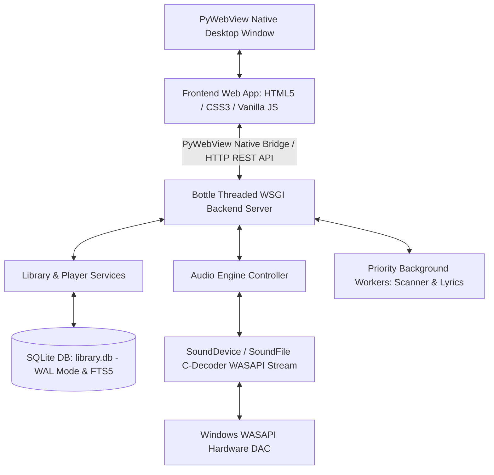

# ZFPlayer Architecture & Technical Specification Document

Tài liệu này mô tả chi tiết kiến trúc hệ thống, 5 luồng xử lý dữ liệu cốt lõi (System Flows) và toàn bộ các yêu cầu kỹ thuật chuyên sâu (Technical Requirements) cho ứng dụng **ZennyFLAC Player (ZFPlayer)**.

---

## 1. Tổng Quan Kiến Trúc (Architectural Overview)

ZFPlayer áp dụng mô hình **Client-Server lai Desktop (Hybrid Desktop Architecture)** với phân tách trách nhiệm (Separation of Concerns) chặt chẽ giữa giao diện người dùng, máy chủ dịch vụ ngầm, phân hệ âm thanh và cơ sở dữ liệu.



### Các Tầng Hệ Thống (System Layers):
1. **Presentation Layer (Frontend):** Giao diện thuần Web (HTML5/CSS3/ES6 JS) thiết kế chuẩn Apple Music Glassmorphism. Quản lý trạng thái bằng luồng dữ liệu 1 chiều (Central State Store).
2. **Application & API Layer (Backend):** Khởi chạy bằng Python 3.11+, dùng Bottle WSGI Server phục vụ REST API đa luồng và PyWebView IPC Native Bridge.
3. **Audio Subsystem:** Sử dụng các thư viện C (`libsndfile` qua `soundfile`, PortAudio qua `sounddevice`) giải mã và truyền dữ liệu PCM nguyên bản trực tiếp tới driver **Windows WASAPI Shared Mode**.
4. **Storage Layer:** Cơ sở dữ liệu SQLite3 hoạt động ở chế độ WAL Mode và hỗ trợ Full-Text Search (FTS5).
5. **Worker Threads Layer:** Luồng quét thư viện nhạc ngầm và luồng ưu tiên tải lời bài hát ngầm (Priority Queue Worker).

---

## 2. Chi Tiết Các Luồng Xử Lý Cốt Lõi (System Flows & Execution Pipelines)

### 2.1 Luồng Khởi Chạy & Cầu Nối IPC / REST Bridge (Startup & IPC Flow)

#### Công nghệ & Module sử dụng:
- **Module Backend:** `backend/app.py`, `backend/api/` (`player_api.py`, `library_api.py`, `lyrics_api.py`, `config_api.py`).
- **Thư viện Backend:** `pywebview`, `bottle`.
- **Module Frontend:** `frontend/js/api.js`, `frontend/js/main.js`.

#### Quy trình xử lý từng bước:
1. Khi chạy `python backend/app.py`, ứng dụng khởi tạo cấu hình từ `config.json` và khởi chạy `Bottle` WSGI Web Server ở chế độ Threaded Server trên cổng local (`http://127.0.0.1:port`).
2. Backend đăng ký các tuyến HTTP REST Endpoints (VD: `/api/library/tracks`, `/api/player/play`, `/api/lyrics/...`).
3. Backend khởi tạo cửa sổ PyWebView (Edge Chromium / WebView2 Engine), nạp tệp `frontend/index.html` và phơi bày Cầu nối Native IPC Bridge (`window.pywebview.api`).
4. Tại Frontend, `api.js` thực hiện kiểm tra cầu nối Native Bridge. Nếu có mặt `pywebview.api`, Frontend gọi trực tiếp các phương thức Python IPC. Ngược lại, Frontend tự động fallback sang gọi HTTP `fetch()` REST API.
5. Frontend nạp thông số khởi tạo (Âm lượng, danh sách 20 bài gần đây) từ Backend và hiển thị giao diện.

---

### 2.2 Luồng Giải Mã & Phát Âm Thanh PCM Zero-Latency (Audio Playback Pipeline)

#### Công nghệ & Module sử dụng:
- **Module Backend:** `backend/audio/engine.py`, `backend/audio/decoder.py`, `backend/audio/buffer.py`, `backend/services/player_service.py`.
- **Thư viện C & Python:** `soundfile` (`libsndfile` C-Decoder), `sounddevice` (PortAudio C-wrapper cho WASAPI), `numpy` C-contiguous array buffer.

#### Quy trình xử lý từng bước:
1. Khi người dùng yêu cầu phát một bài hát (`path`), `StreamingDecoder` mở luồng đọc dữ liệu âm thanh (FLAC, WAV, MP3, M4A, OGG) theo từng khối (chunk) thông qua `soundfile.blocks()` thay vì nạp toàn bộ vào RAM, truyền dữ liệu giải mã dạng `float32` vào bộ đệm vòng (`AudioRingBuffer`) giúp chống tràn bộ nhớ (OOM) tuyệt đối.
2. **Căn chỉnh Bit-depth:**
   - Dữ liệu âm thanh gốc 16-bit, 24-bit hay 32-bit đều được tự động giải mã và quy chuẩn (normalize) về định dạng `float32` PCM.
   - Điều này giúp `AudioEngine` thực hiện xử lý âm lượng (Volume scaling) và mờ dần (Fade in/out) mượt mà không làm vỡ tiếng trước khi đẩy xuống WASAPI.
   - *32-bit Float / PCM:* Đọc dạng `float32` truyền thẳng tới DAC.
3. **Phát âm thanh ngầm & Chế độ WASAPI Dual-Engine (Non-blocking Audio Stream Callback):**
   - Hỗ trợ 2 chế độ truyền dữ liệu WASAPI tùy chọn trong Settings: **WASAPI Shared Mode** (`sd.WasapiSettings(exclusive=False)`) và **WASAPI Exclusive Mode - Push Driven** (`sd.WasapiSettings(exclusive=True)` kết hợp cờ `paWinWasapiPolling`).
   - Tự động truy vấn thiết bị WASAPI output ID để tránh lỗi `PaErrorCode -9984` và hỗ trợ tự động fallback về Shared Mode nếu phần cứng bận.
   - **Kỹ thuật Clean Stream Initialization**: Loại bỏ Stream Reuse do lỗi khởi tạo bộ đệm của PortAudio trên WASAPI Exclusive Push. Giờ đây, mỗi bài hát mới sẽ luôn được cấp phát một Stream WASAPI hoàn toàn sạch để đảm bảo tốc độ và độ ổn định (triệt tiêu lỗi speed-up/choppy), với chi phí khởi tạo cực thấp (~50ms) được che giấu qua lớp debounce.
   - **Kỹ thuật Deadlock-Free Stream Tear-down**: Giải phóng khóa `self._lock` trước khi gọi `stream.stop()` / `close()` ngầm, đảm bảo không bao giờ bị nghẽn luồng giữa PortAudio C callback và Python GIL.
   - **Kỹ thuật Micro Anti-Pop Ramps**: Áp dụng Micro Fade-In Ramp (20ms) khi Play/Resume, Micro Fade-Out Ramp (15ms) khi Pause/Stop, và Micro Ramp (15ms) khi Seek để triệt tiêu tiếng nổ/xì lách tách.
4. **Tua nhạc (Seek) & Lặp lại (Loop) 0ms:**
   - Việc chuyển vị trí phát nhạc (Seek) hoặc phát lại (Loop) chỉ thực hiện thay đổi giá trị chỉ số `current_frame` trong RAM. Do không phải đọc lại đĩa cứng (Disk I/O = 0), độ trễ phản hồi đạt chính xác 0ms (Zero-Latency).

---

### 2.3 Luồng Quét Nhạc Ngầm & Đánh Chỉ Mục Tìm Kiếm (Library Scanner & Indexing Pipeline)

#### Công nghệ & Module sử dụng:
- **Module Backend:** `backend/workers/scanner.py`, `backend/services/library_service.py`, `backend/storage/database.py`.
- **Thư viện Python:** `threading.Thread`, `os.walk`, `mutagen` (FLAC, MP3, M4A parser), SQLite3 FTS5.

#### Quy trình xử lý từng bước:
1. Khi người dùng thêm một thư mục nhạc trong Settings, `LibraryScanner` khởi tạo một `threading.Thread` riêng biệt chạy ngầm để không gây đóng băng UI Frontend.
2. Worker quét duyệt cây thư mục bằng `os.walk`, lọc ra các tệp có phần mở rộng hợp lệ (`.flac`, `.mp3`, `.wav`, `.m4a`, `.ogg`).
3. Sử dụng `mutagen` đọc chi tiết Thẻ Metadata Hi-Res: Title, Artist, Album, Genre, Duration, Bitrate, Samplerate, Bit-depth, và trích xuất dữ liệu ảnh bìa Album (`cover_art`).
4. **Ghi CSDL theo Lô (Batch Transaction):**
   - Dữ liệu bài hát được gom thành các lô (batch 100 bài) và thực thi câu lệnh `INSERT OR REPLACE INTO tracks` trong cùng một Transaction để tối ưu đĩa.
   - Hệ thống tự động cập nhật dữ liệu vào bảng chỉ mục tìm kiếm `tracks_fts` (SQLite FTS5) để phục vụ tìm kiếm siêu tốc.
5. Sau khi quét xong, danh sách bài hát mới tự động được đẩy vào `LyricsWorker` để xếp hàng tải lời bài hát ngầm.

---

### 2.4 Luồng Tải & Đồng Bộ Lời Bài Hát (Priority Queue Synced Lyrics Pipeline)

#### Công nghệ & Module sử dụng:
- **Module Backend:** `backend/workers/lyrics_worker.py`, `backend/services/player_service.py`.
- **Thư viện Python:** `queue.PriorityQueue`, `requests`, `syncedlyrics`, `mutagen`, API `LRCLIB`.

#### Quy trình xử lý từng bước:
1. **Quản lý Hàng Đợi Ưu Tiên 2 Cấp:**
   - *Priority 1 (Ưu tiên cao):* Khi phát nhạc hoặc chuyển bài, `PlayerService` đẩy bài đang phát và 5 bài tiếp theo vào Queue với `priority=True`.
   - *Priority 10 (Ưu tiên thấp):* Khi import nhạc mới, `LibraryScanner` đẩy toàn bộ bài hát vào Queue với `priority=False`.
2. **Tiêu Thụ Tuần Tự & Throttle Control:**
   - `LyricsWorker` chạy 1 luồng duy nhất (`_queue_loop`) tiêu thụ từng phần tử trong `PriorityQueue`.
   - Giữa mỗi request tải lời bài hát, worker thực hiện `time.sleep(0.5)` (Throttle 0.5s) nhằm triệt tiêu nguy cơ API bị Rate Limit và ngăn chặn hiện tượng khóa ghi CSDL (SQLite write-lock contention).
3. **Thác Nước 4 Cấp Ưu Tiên Nguồn (4-Level Fallback Waterfall):**
   - *Cấp 1 (Local LRC):* Quét tệp `.lrc` nằm cùng thư mục và cùng tên với bài hát.
   - *Cấp 2 (LRCLIB Search):* Gọi API `LRCLIB` (`/api/search`), tự động lọc ra bản lyric khớp nhất với thời lượng bài hát ($\le 3.0s$).
   - *Cấp 3 (Embedded Tag):* Đọc thẻ lời bài hát nhúng sẵn trong tệp âm thanh (`USLT`, `LYRICS`).
   - *Cấp 4 (Syncedlyrics Online):* Tra cứu trực tuyến qua `syncedlyrics` (Musixmatch / NetEase / Megalobiz).
4. Lời bài hát thu thập được lưu vào bảng `lyrics_cache` trong `library.db` và gửi thông báo cập nhật về Frontend.

---

### 2.5 Luồng Frontend State Management & Render Virtual Scrolling (UI Pipeline)

#### Công nghệ & Module sử dụng:
- **Module Frontend:** `frontend/js/store.js`, `frontend/js/library.js`, `frontend/js/player.js`, `frontend/js/lyrics.js`, `frontend/css/main.css`.
- **Công nghệ Frontend:** Vanilla ES6 JavaScript, CSS Glass Tokens, GPU Acceleration.

#### Quy trình xử lý từng bước:
1. **Luồng Dữ Liệu 1 Chiều (Unidirectional Data Flow):**
   - Trạng thái ứng dụng (`currentTrack`, `isPlaying`, `volume`, `progress`, `view`) được lưu tại Central Store (`store.js`).
   - Khi có thay đổi state, `store.setState()` tự động phát thông báo tới tất cả các thành phần Subscribe (`player.js`, `library.js`, `home.js`, `lyrics.js`) để cập nhật lại đúng vùng DOM cần thiết.
2. **Thuật Toán Cuộn Danh Sách Ảo (Offset-aware VirtualList Index Math):**
   - Khi cuộn danh sách hàng chục nghìn bài hát, `library.js` tính toán vị trí hiển thị:
     $$\text{trackScrollTop} = \max(0, \text{scrollTop} - \text{offsetTop})$$
     $$\text{startIndex} = \max\left(0, \left\lfloor \frac{\text{trackScrollTop}}{\text{itemHeight}} \right\rfloor - \text{buffer}\right)$$
     $$\text{endIndex} = \min\left(\text{totalItems} - 1, \left\lceil \frac{\text{trackScrollTop} + \text{containerHeight}}{\text{itemHeight}} \right\rceil + \text{buffer}\right)$$
   - Chỉ khoảng $(\text{endIndex} - \text{startIndex})$ hàng (chỉ ~30 đến 40 DOM nodes) được thực sự render trên cây DOM với hai khoảng đệm padding top/bottom tương ứng. Nhờ đó, thao tác cuộn mượt mà ở tốc độ 60–120 FPS.
3. **Hiệu Ứng Nền Kính Mờ Động (Dynamic Glassmorphic Backdrop):**
   - Khi bài hát thay đổi, Frontend lấy đường dẫn ảnh bìa `cover_art`, gán làm `background-image` cho container đệm và áp dụng thuộc tính `backdrop-filter: blur(80px) saturate(1.5)` để biến đổi màu nền xuyên thấu theo tone màu của Album.

---

## 3. Các Yêu Cầu Kỹ Thuật Chuyên Sâu (Deep Technical Requirements)

Bảng tra cứu yêu cầu kỹ thuật chi tiết giúp nhà phát triển kế thừa hiểu rõ các ràng buộc hệ thống:

### 3.1 Phần Cứng & Hệ Điều Hành (Hardware & OS Specifications)
- **Hệ điều hành:** Windows 10 / 11 64-bit (Yêu cầu bắt buộc để hỗ trợ giao tiếp driver Windows WASAPI).
- **Bộ xử lý (CPU):** Intel / AMD x86_64, tối thiểu 2 Cores.
- **Bộ nhớ (RAM):** Tối thiểu 2GB RAM. Khuyên dùng 4GB+ để đảm bảo bộ nhớ đệm RAM Playback nạp trơn tru các tệp Hi-Res Audio 24-bit/192kHz (kích thước tệp PCM trong RAM có thể lên tới 150MB - 200MB/track).
- **Phân hệ Âm thanh (Audio Device):** Sound Card hoặc USB DAC hỗ trợ Windows WASAPI Shared Mode.

### 3.2 Môi Trường & Thư Viện Phụ Thuộc (Backend Dependencies & Runtime)
- **Python Version:** Python 3.11+ 64-bit.
- **Phụ thuộc C-level & API Bindings:**
  - `sounddevice` (v0.4.6+): PortAudio C-wrapper giao tiếp trực tiếp với WASAPI Host API.
  - `soundfile` (v0.12.1+): C-binding của `libsndfile` hỗ trợ giải mã nguyên bản các định dạng FLAC, WAV, OGG.
  - `numpy` (v1.24+): C-contiguous array buffer lưu trữ PCM thô.
  - `mutagen` (v1.46+): Đọc thẻ âm thanh Hi-Res (FLAC vorbis comment, ID3v2, MP4 tags).
  - `bottle` (v0.12+): WSGI Web Server đa luồng siêu nhẹ.
  - `pywebview` (v4.0+): Trình duyệt nhúng MS HTML/Edge Chromium (WebView2).
  - `requests` & `syncedlyrics`: Tải lời bài hát ngầm qua HTTP/HTTPS.

### 3.3 Cơ Sở Dữ Liệu & Cấu Hình WAL Mode (Database Specifications)
- **Engine:** SQLite3 hỗ trợ extension Full-Text Search (FTS5).
- **Cấu hình Tối ưu hóa SQLite:**
  ```sql
  PRAGMA journal_mode = WAL;
  PRAGMA synchronous = NORMAL;
  PRAGMA cache_size = -64000; -- 64MB Cache
  PRAGMA temp_store = MEMORY;
  ```
- **Chiến lược Đánh Chỉ Mục (Indexing Strategy):**
  - Chỉ mục `idx_tracks_last_played` trên trường `last_played DESC` giúp truy vấn 20 bài gần đây đạt tốc độ $< 1\text{ms}$.
  - Chỉ mục gộp `idx_tracks_title_artist` cho thao tác sắp xếp và lọc danh sách.
  - Bảng chỉ mục ảo `tracks_fts` sử dụng tokenizer `unicode61` phục vụ tìm kiếm bài hát không dấu/có dấu.
- **Bảo trì Đĩa:** Thực thi lệnh `VACUUM` định kỳ để tái cấu trúc tệp CSDL vật lý.

### 3.4 Hiệu Năng Frontend & Virtual Scrolling (Frontend & Rendering Specs)
- **Giới hạn Cây DOM (DOM Node Limit):** Cây DOM không vượt quá 500 nodes tại bất kỳ thời điểm nào nhờ thuật toán `VirtualList`.
- **GPU Hardware Acceleration:** Sử dụng các thuộc tính CSS được tối ưu hóa GPU (`transform`, `opacity`, `will-change: transform`) cho toàn bộ Modals, Context Menu và View Transitions.
- **CSS Glass Tokens:** Sử dụng biến CSS chuẩn hóa cho độ mờ (`backdrop-filter: blur(40px)` đến `blur(80px)`) và độ trong suốt `rgba(255, 255, 255, 0.03)` đến `rgba(255, 255, 255, 0.15)`.

### 3.5 Quy Tắc Đa Luồng & An Toàn Thread (Concurrency & Thread Safety Rules)
- **Audio Thread Isolation:** Callback phát âm thanh của PortAudio/WASAPI chạy ở luồng ưu tiên thời gian thực (Real-time thread). **Tuyệt đối không** thực hiện bất kỳ thao tác I/O đĩa, đọc ghi DB hay gọi mạng trong hàm callback này.
- **Single-Thread Priority Queue for Lyrics:** Luồng `LyricsWorker` duy trì duy nhất 1 thread tiêu thụ queue để ngăn chặn triệt để rủi ro xung đột ghi CSDL SQLite (Write lock contention) và quá tải API bên ngoài.
- **Background Scan Safety:** Thao tác quét thư viện nhạc chạy trên `threading.Thread` riêng, thực thi ghi CSDL theo từng Batch Transaction ngắn và đóng cursor ngay sau khi ghi.

### 3.6 Chỉ Số Hiệu Năng & Giới Hạn SLA (Performance Benchmarks)
- **Độ trễ tua / lặp nhạc (Seek & Loop Latency):** $0\text{ms}$ (do dữ liệu PCM nằm sẵn trên RAM).
- **Tải CPU ở trạng thái phát nhạc (CPU Idle Playing):** $< 0.5\%$ CPU.
- **Tải CPU ở trạng thái quét thư viện (Library Scan):** $< 15\%$ CPU.
- **Tỷ lệ khung hình Giao diện (UI Frame Rate):** Đạt ổn định $60\text{ FPS} - 120\text{ FPS}$ khi cuộn danh sách 50.000+ bài hát.
- **Dung lượng Bộ nhớ (RAM Usage):** $\sim 150\text{MB} - 400\text{MB}$ RAM tùy thuộc vào số lượng bài hát trong thư viện và kích thước file FLAC đang được nạp vào RAM.
