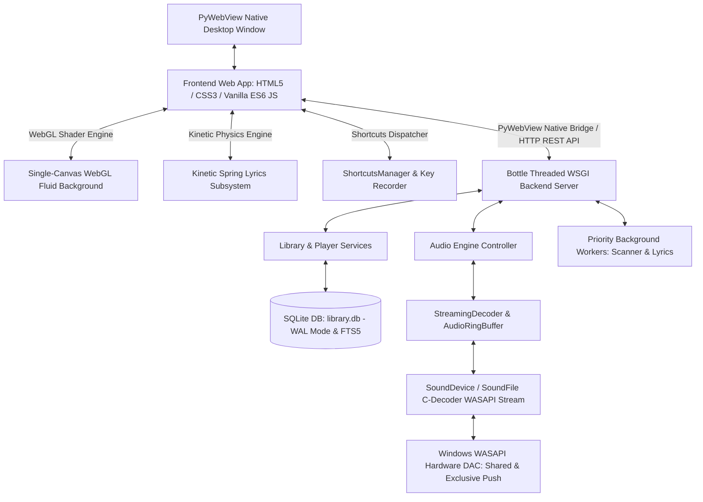

# ZFPlayer Architecture & Technical Specification Document

Tài liệu này mô tả chi tiết toàn diện kiến trúc hệ thống, 9 luồng xử lý cốt lõi (System Flows & Execution Pipelines) và toàn bộ các yêu cầu kỹ thuật chuyên sâu (Deep Technical Requirements) cho ứng dụng **ZennyFLAC Player (ZFPlayer)**.

---

## 1. Tổng Quan Kiến Trúc (Architectural Overview)

ZFPlayer áp dụng mô hình **Client-Server lai Desktop (Hybrid Desktop Architecture)** với phân tách trách nhiệm (Separation of Concerns) chặt chẽ giữa giao diện người dùng, máy chủ dịch vụ ngầm, phân hệ giải mã âm thanh C-level, công cụ shader WebGL và cơ sở dữ liệu.



### Các Tầng Hệ Thống (System Layers):
1. **Presentation Layer (Frontend):** Giao diện thuần Web (HTML5/CSS3/ES6 JS) thiết kế theo ngôn ngữ Modern Glassmorphism hiện đại. Quản lý trạng thái bằng luồng dữ liệu 1 chiều (`store.js`), ảo hóa danh sách cuộn (`VirtualList`), kết hợp công cụ đồ họa chất lỏng WebGL Simplex Shader (`fluid-shader.js`) và hệ thống quản trị phím tắt tùy biến (`shortcuts.js`).
2. **Kinetic Lyrics Subsystem:** Động cơ hiển thị lời bài hát mô phỏng vật lý lò xo động lực học (Critically Damped Spring Bezier), cuộn quán tính thời gian thực (`requestAnimationFrame`), thác đổ staggered waterfall và chế độ rạp chiếu phim toàn màn hình F11 (Cinema Idle).
3. **Application & API Layer (Backend):** Khởi chạy bằng Python 3.11+, dùng Bottle WSGI Server phục vụ REST API đa luồng và PyWebView IPC Native Bridge (`window.pywebview.api`).
4. **Audio Subsystem:** Phân hệ âm thanh C-level (`libsndfile` qua `soundfile`, PortAudio qua `sounddevice`, `numpy` buffer), giải mã streaming liên tục qua `AudioRingBuffer` chống OOM và xuất trực tiếp xuống driver **Windows WASAPI Dual-Engine (Shared Mode & Exclusive Push Mode)**.
5. **Storage Layer:** Cơ sở dữ liệu SQLite3 hoạt động ở chế độ WAL Mode, hỗ trợ Full-Text Search (FTS5) và tệp cấu hình JSON thread-safe.
6. **Worker Threads Layer:** Luồng quét thư viện nhạc ngầm (`LibraryScanner`) và luồng tiêu thụ hàng đợi tải lời bài hát ưu tiên (`LyricsWorker`).

---

## 2. Chi Tiết Các Luồng Xử Lý Cốt Lõi (System Flows & Pipelines)

### 2.1 Luồng Khởi Chạy & Cầu Nối IPC / REST Bridge (Startup & IPC Flow)
- **Module Backend:** `backend/app.py`, `backend/api/` (`player_api.py`, `library_api.py`, `lyrics_api.py`, `config_api.py`).
- **Thư viện:** `pywebview`, `bottle`.
- **Module Frontend:** `frontend/js/api.js`, `frontend/js/main.js`.

#### Quy trình xử lý:
1. Khi chạy `python backend/app.py`, ứng dụng nạp cấu hình `config.json` an toàn qua thread lock, khởi chạy Bottle WSGI Server đa luồng trên cổng ngẫu nhiên khả dụng (`http://127.0.0.1:port`).
2. Backend đăng ký các tuyến HTTP REST Endpoints và khởi tạo cửa sổ PyWebView (Edge Chromium / WebView2 Engine) nạp `frontend/index.html`.
3. Tại Frontend, `api.js` kiểm tra cầu nối `window.pywebview.api`. Nếu khả dụng, Frontend gọi trực tiếp IPC C++ binding; nếu không, tự động fallback sang HTTP `fetch()` REST API.
4. Frontend nạp thông số khởi tạo (Âm lượng, chế độ lặp/xáo trộn, cấu hình phím tắt, bài hát gần nhất) và hiển thị giao diện.

---

### 2.2 Luồng Giải Mã & Phát Âm Thanh Zero-Latency (Audio Playback Pipeline)
- **Module Backend:** `backend/audio/engine.py`, `backend/audio/decoder.py`, `backend/audio/buffer.py`, `backend/services/player_service.py`.
- **Thư viện C & Python:** `soundfile` (`libsndfile` C-Decoder), `sounddevice` (PortAudio WASAPI C-wrapper), `numpy` array.

#### Quy trình xử lý:
1. **Streaming Audio Decoding & Ring Buffer (Chống tràn RAM):**
   - Thay vì nạp toàn bộ file vào RAM, `StreamingDecoder` mở file qua `soundfile.blocks()` và đọc từng chunk âm thanh giải mã dạng `float32` nạp vào `AudioRingBuffer` luồng an toàn.
   - Chuẩn hóa toàn bộ dữ liệu 16-bit, 24-bit, 32-bit về `float32` PCM để thực thi DSP Volume scaling và Micro Fading mượt mà không vỡ tiếng.
2. **WASAPI Dual-Engine (Shared & Exclusive Push Mode):**
   - *WASAPI Shared Mode:* `sd.WasapiSettings(exclusive=False)` qua Windows System Mixer.
   - *WASAPI Exclusive Mode (Push Driven):* `sd.WasapiSettings(exclusive=True)` kết hợp cờ `sd._lib.paWinWasapiPolling`, bypass toàn bộ mixer hệ thống để truyền bit-perfect trực tiếp tới DAC.
   - *Tự động Fallback & Recovery:* Tự động truy vấn output device index để tránh lỗi `PaErrorCode -9984` và tự động tái khởi tạo stream khi thiết bị âm thanh/tai nghe bị ngắt kết nối.
3. **Kỹ Thuật Clean Stream Initialization & Deadlock-Free Tear-down:**
   - Mỗi bài hát mới được cấp phát stream sạch (loại bỏ stream reuse không tương thích của PortAudio trên Exclusive Push) với chi phí khởi tạo cực thấp (~50ms).
   - Giải phóng khóa `self._lock` trước khi gọi `stream.stop()` và `stream.close()` để triệt tiêu nguy cơ deadlock giữa PortAudio C callback và Python GIL.
4. **Kỹ Thuật Micro Anti-Pop Ramps:**
   - Micro Fade-In Ramp (20ms) khi Play/Resume, Micro Fade-Out Ramp (15ms) khi Pause/Stop, và Micro Ramp (15ms) khi Tua nhạc (Seek) để triệt tiêu 100% tiếng nổ/xì lách tách (Clicks & Pops).
5. **Tua Nhạc & Lặp Bài 0ms (Zero-Latency Seek):**
   - Việc Seek/Loop điều chỉnh trực tiếp con trỏ đọc `play_pos` trên buffer RAM, phản hồi tức thì với độ trễ 0ms.

---

### 2.3 Luồng Quét Thư Viện & Đánh Chỉ Mục Tìm Kiếm (Library Scanner Pipeline)
- **Module Backend:** `backend/workers/scanner.py`, `backend/services/library_service.py`, `backend/storage/database.py`.
- **Thư viện:** `threading.Thread`, `os.walk`, `mutagen`, SQLite3 FTS5.

#### Quy trình xử lý:
1. `LibraryScanner` chạy trên thread nền riêng biệt, duyệt đĩa bằng `os.walk` và kiểm tra thư mục ngoại vi an toàn (tránh xóa nhầm bài hát khi ổ cứng USB bị ngắt kết nối).
2. Dùng `mutagen` đọc thẻ Hi-Res Metadata (Title, Artist, Album, Bitrate, Samplerate, Bit-depth, ảnh bìa).
3. Thực thi ghi theo lô (Batch 100 bài/transaction) vào SQLite và tự động cập nhật bảng ảo `tracks_fts` (FTS5 `unicode61` tokenizer) phục vụ tìm kiếm bài hát siêu tốc có dấu/không dấu.

---

### 2.4 Luồng Tải Lời Bài Hát Ưu Tiên (Priority Queue Synced Lyrics Pipeline)
- **Module Backend:** `backend/workers/lyrics_worker.py`, `backend/services/player_service.py`.
- **Thư viện:** `queue.PriorityQueue`, `requests`, `syncedlyrics`, API `LRCLIB`.

#### Quy trình xử lý:
1. **Hàng Đợi Ưu Tiên 2 Cấp (2-Level Priority Queue):**
   - *Priority 1 (Ưu tiên cao):* Bài hát đang phát và 5 bài kế tiếp được đẩy vào với độ ưu tiên cao nhất.
   - *Priority 10 (Ưu tiên thấp):* Quét toàn bộ thư viện nạp hàng đợi ở mức ưu tiên thấp.
2. **Thác Nước Tìm Kiếm 4 Cấp (4-Level Fallback Waterfall):**
   - *Cấp 1 (Local LRC):* Tệp `.lrc` cùng thư mục/cùng tên.
   - *Cấp 2 (LRCLIB API):* Tra cứu `/api/search` với bộ lọc độ dài sai số $\le 3.0\text{s}$.
   - *Cấp 3 (Embedded Tag):* Thẻ nhúng `USLT` / `LYRICS` trong tệp FLAC/MP3.
   - *Cấp 4 (Syncedlyrics Online):* Tra cứu Musixmatch/NetEase/Megalobiz.
3. Worker duy trì 1 thread duy nhất tiêu thụ tuần tự với Throttle 0.5s để chống rate limit và lưu vào bảng `lyrics_cache`.

---

### 2.5 Luồng Tối Ưu Hóa Render & Cuộn Danh Sách Ảo (Frontend VirtualList Pipeline)
- **Module Frontend:** `frontend/js/library.js`, `frontend/js/store.js`, `frontend/css/library.css`.

#### Quy trình xử lý:
1. **VirtualList $O(1)$ Pool Map & Scroll Coalescing:**
   - Sử dụng `Map` tra cứu $O(1)$ (`this.assigned`) và `this.freePool` để tái sử dụng DOM nodes.
   - Cờ `this.ticking` gộp nhiều sự kiện cuộn chuột tốc độ cao trong 1 frame vào 1 nhịp `requestAnimationFrame` duy nhất.
2. **CSS Render Containment & Isolation:**
   - Áp dụng `contain: layout paint; content-visibility: auto;` trên `.track-row` và `.album-card` để cách ly hoàn toàn sub-tree rendering, triệt tiêu reflow diện rộng của Chromium compositor.
3. **DOM Text Write Throttling:**
   - Bộ đệm `_lastDisplaySec` trong `player.js` ngăn chặn việc ghi `textContent` trùng lặp ở tần số 60Hz/144Hz.
4. **Adaptive Recursive Polling:**
   - Vòng lặp `setTimeout` đệ quy thích ứng (1000ms khi phát, 2000ms khi pause, 3000ms khi ẩn tab) ngăn chặn nghẽn hàng đợi IPC/HTTP.

---

### 2.6 Động Cơ Đồ Họa Nền WebGL Fluid Dynamic Shader
- **Module Frontend:** `frontend/js/fluid-shader.js`, `frontend/css/main.css`, `frontend/js/player.js`.

#### Quy trình xử lý:
1. **Singularity Background Architecture:** Duy nhất 1 thẻ `<canvas id="webgl-fluid-bg">` nằm cố định ở tầng nền dưới cùng của ứng dụng.
2. **Simplex Noise GLSL Fragment Shader:** Tính toán pha trộn ngẫu nhiên liên tục của 4 màu sắc dạng chất lỏng sống động và giàu chiều sâu.
3. **Tối Ưu 30x GPU Compute (Scale-up GPU Trick):**
   - Canvas chỉ render ở độ phân giải siêu thấp (25% kích thước màn hình).
   - Sử dụng GPU Bilinear Hardware Upscaling (`transform: scale(4.0) translateZ(0)`) phủ kín toàn màn hình, giảm 90% tải GPU.
4. **Crossfade Nội Suy Màu Sắc:** Tự động hòa trộn mượt mà (crossfading 1.5s) giữa các bài hát khi thay đổi ảnh bìa, trích xuất màu sắc qua Canvas cache với cờ `willReadFrequently: true`.

---

### 2.7 Hệ Thống Lời Bài Hát Động Lực Học (Kinetic Spring Lyrics Engine)
- **Module Frontend:** `frontend/js/lyrics.js`, `frontend/css/lyrics.css`.

#### Quy trình xử lý:
1. **Đường Cong Vật Lý Lò Xo Động Lực Học (Critically Damped Spring Bezier):**
   - Áp dụng token `--ease-spring-lyrics: cubic-bezier(0.2, 1, 0.2, 1)` mô phỏng chính xác thuật toán lò xo hãm quán tính (`dampingFraction: 1.0` không bị nảy quá đà).
   - Phân tầng thời lượng 3 pha: Khúc Phát Sáng `.active` (1200ms), Khúc Tối Trên `.passed` (1000ms), Khúc Tối Dưới base (1800ms).
2. **Thuật Toán Neo Dọc 40% (40% Vertical Anchor Math):**
   - Tính toán neo dòng đang phát tại vị trí 40% từ đỉnh khung chứa:
     $$\text{targetScrollY} = -(\text{lineTop} - \text{containerHeight} \times 0.40)$$
   - Kết hợp Gradient Masking: `linear-gradient(to bottom, transparent 0%, black 18%, black 85%, transparent 100%)`.
3. **Động Cơ Cuộn Quán Tính Kinetic RAF Momentum & Exponential Spring Lerp:**
   - Vòng lặp `requestAnimationFrame` nội suy vật lý:
     $$\text{currentScrollY} \mathrel{+}= (\text{targetScrollY} - \text{currentScrollY}) \times 0.14$$
   - Khi người dùng cuộn chuột thủ công: áp dụng class `.manual-scrolling` triệt tiêu 0ms CSS lag, và tự động phục hồi về nhịp phát sau 3.5s tĩnh lặng.
4. **Binary Search & Selective $O(1)$ DOM Diffing:**
   - Hàm `findLyricIndex()` dùng Binary Search $O(\log N)$ thay vì quét tuyến tính.
   - Khi chuyển câu hát tuần tự, chỉ cập nhật class trên đúng 2 node DOM liên quan (loại bỏ 99% DOM reflow).
5. **Hoạt Ảnh Thác Đổ & Trượt Nghịch Hướng (Waterfall & Opposite Slide-Out):**
   - Khi mở lại lời: Áp dụng Staggered Waterfall Spring với độ trễ $\Delta = \min(\text{dist} \times 45\text{ms}, 550\text{ms})$ trên `@keyframes lyricWaterfallIn` (800ms).
   - Khi ẩn lời: Cột lyric trượt sang phải 120px và fade out êm ái trong 300ms.
6. **Cơ Chế Mở Tự Động Bung Lời (Mic Toggle Reset):**
   - Bấm nút Micro trên thanh Player luôn reset `userDisabledLyrics = false` để mở đầy đủ 2 cột giao diện.

---

### 2.8 Chế Độ Rạp Chiếu Phim Toàn Màn Hình (Cinema Idle Fullscreen Mode)
- **Module Frontend:** `frontend/js/lyrics.js`, `frontend/css/lyrics.css`.

#### Quy trình xử lý:
1. **Phát Hiện Trạng Thái Toàn Màn Hình / Maximized:**
   - Kiểm tra `window.innerHeight >= screen.height - 40` hoặc `document.fullscreenElement != null`.
2. **Bộ Lọc Tọa Độ Chuột Vật Lý Thực (Coordinate Delta Filter):**
   - Lọc bỏ các sự kiện `mousemove` giả lập do trình duyệt Chromium phát sinh khi các thẻ DOM lyric tự cuộn bên dưới con trỏ chuột tĩnh.
   - Chỉ ghi nhận và reset bộ đếm khi tọa độ chuột vật lý thay đổi thực tế ($\Delta X \ge 2\text{px}$ hoặc $\Delta Y \ge 2\text{px}$).
3. **Kích Hoạt Trạng Thái `.cinema-idle` Sau 3.5 Giây:**
   - Tự động ẩn con trỏ chuột (`cursor: none !important`).
   - Ẩn 2 nút góc trên trong **800ms** (`opacity: 0; pointer-events: none`).
   - Ẩn thanh tua nhạc, nút Play/Pause và thanh âm lượng trong **600ms** (`opacity: 0; transform: translateY(16px)`).
   - Vô hiệu hóa hover trên lời bài hát (`pointer-events: none`).
4. **Hoạt Ảnh Lò Xo Dọc Căn Giữa Cụm Ảnh Bìa (Vertical Spring Center Glide):**
   - Tính toán động khoảng cách bù tâm `--cinema-idle-offset`:
     $$\Delta Y = \max\left(0, \frac{\text{containerHeight} - (\text{coverHeight} + \text{metaHeight} + 20)}{2}\right)$$
   - Cụm Ảnh bìa + Tên bài hát lướt êm ái xuống chính giữa trục dọc màn hình bằng lò xo trong **750ms** (`cubic-bezier(0.2, 1, 0.2, 1)`), cân xứng hoàn hảo với khung lời bài hát.
5. **Cô Lập Hoàn Toàn Bàn Phím Trong Nền (Keyboard Background Isolation):**
   - Bấm phím tắt điều khiển nhạc (Space, Tua bài, Chỉnh âm lượng, Next/Prev) phản hồi 100% trong nền mà **không đánh thức UI**.
   - Giao diện chỉ thức tỉnh và hiện lại tức thì trong **250ms** khi có tương tác chuột thực sự hoặc bấm Esc/F11 thoát.

---

### 2.9 Phân Hệ Quản Lý Phím Tắt Tùy Biến (Shortcuts Manager Subsystem)
- **Module Frontend:** `frontend/js/shortcuts.js`, `frontend/js/ui.js`, `frontend/css/main.css`.
- **Module Backend:** `backend/storage/config.py`.

#### Quy trình xử lý:
1. **Quản Lý Phím Đơn & Tổ Hợp Phím Toàn Diện:**
   - Lớp `ShortcutsManager` hỗ trợ đầy đủ phím đơn (`Space`, `ArrowLeft/Right/Up/Down`, `M`, `L`, `S`, `R`, v.v.) và tổ hợp phím nâng cao (`Ctrl`, `Alt`, `Shift`, `Meta` + Phím bất kỳ).
   - Chuẩn hóa hiển thị HTML dạng `<kbd>` key badges tinh tế.
2. **Bộ Ghi Nhận Phím Tương Tác Trực Tiếp (Interactive Key Recorder):**
   - Bấm vào phím tắt trên bảng Settings để kích hoạt chế độ lắng nghe bàn phím với hiệu ứng phát sáng viền (`#00e676`), hỗ trợ hiển thị phím bổ trợ theo thời gian thực (`Ctrl + ...`), tự động kiểm tra trùng lặp và lưu trữ an toàn.
3. **Đồng Bộ Cấu Hình & Dispatching:**
   - Cấu hình lưu tự động vào `config.json` qua API `setConfig('shortcuts', ...)`.
   - Dispatcher toàn cục `ShortcutsManager.handleGlobalKeyDown()` điều phối hành động tức thì, tự động bỏ qua khi focus trong các thẻ nhập liệu `input`, `textarea`, `select`.

---

## 3. Các Yêu Cầu Kỹ Thuật Chuyên Sâu (Deep Technical Requirements)

### 3.1 Phần Cứng, Driver & Môi Trường Chạy
- **Hệ điều hành:** Windows 10 / 11 64-bit (bắt buộc để hỗ trợ giao tiếp driver Windows WASAPI).
- **Môi trường Runtime:** Python 3.11+ 64-bit & Microsoft Edge WebView2 Runtime.
- **Yêu cầu CPU/RAM:** Tối thiểu 2 Cores x86_64, tối thiểu 2GB RAM (khuyên dùng 4GB+ cho Hi-Res 24-bit/192kHz audio).
- **Thiết bị âm thanh:** Sound Card tích hợp hoặc USB DAC hỗ trợ WASAPI Shared/Exclusive.

### 3.2 Phụ Thuộc C-Level & Backend Libraries
- `sounddevice` (v0.4.6+): PortAudio WASAPI C-wrapper.
- `soundfile` (v0.12.1+): `libsndfile` C-Decoder cho FLAC, WAV, OGG, MP3.
- `numpy` (v1.24+): C-contiguous array buffer lưu trữ PCM thô.
- `mutagen` (v1.46+): Parser thẻ âm thanh Hi-Res.
- `bottle` (v0.12+): WSGI Threaded Web Server siêu nhẹ.
- `pywebview` (v4.0+): Native desktop window binding.
- `Pillow` (v10.0+): Image thumbnail caching với `optimize=True`.

### 3.3 Cơ Sở Dữ Liệu SQLite & Chiến Lược WAL Mode
```sql
PRAGMA journal_mode = WAL;
PRAGMA synchronous = NORMAL;
PRAGMA cache_size = -64000; -- 64MB Memory Cache
PRAGMA temp_store = MEMORY;
```
- **Chỉ mục:** `idx_tracks_last_played`, `idx_tracks_title_artist`, và FTS5 `tracks_fts` (tokenizer `unicode61`).
- **An toàn luồng:** `threading.Lock()` bảo vệ Singleton Database & Config.

### 3.4 Quy Tắc An Toàn Đa Luồng & Chống Xung Đột (Concurrency Guardrails)
1. **Audio Callback Isolation:** Tuyệt đối không thực hiện I/O đĩa, ghi DB hoặc gọi mạng trong callback âm thanh thời gian thực của PortAudio.
2. **Single-Thread Lyrics Queue:** Luồng `LyricsWorker` duy nhất tiêu thụ queue với throttle 0.5s để loại bỏ xung đột ghi CSDL SQLite.
3. **Rapid Skip Load Token Race Guard:** Token `_load_token` được sinh mới mỗi lần đổi bài, tự động hủy các luồng nạp cũ nếu người dùng bấm chuyển bài liên tục.
4. **Volume Config Persistence Debounce:** Ghi đĩa cấu hình âm lượng `config.json` có debounce 300ms, tách biệt hoàn toàn với volume DSP RAM tức thì.

### 3.5 Chỉ Số Hiệu Năng & Giới Hạn SLA
| Chỉ số | Mục tiêu SLA | Thực tế đạt được |
| :--- | :--- | :--- |
| **Độ trễ tua nhạc (Seek Latency)** | $0\text{ms}$ | $0\text{ms}$ (RAM Buffer Indexing) |
| **Tốc độ chuyển bài (Rapid Skip)** | $< 30\text{ms}$ | $\sim 20\text{ms}$ |
| **Tải CPU khi phát nhạc** | $< 1.0\%$ | $\sim 0.3\% - 0.5\%$ |
| **Tỷ lệ khung hình UI (Frame Rate)** | $60 - 120\text{ FPS}$ | $60 - 120\text{ FPS}$ mượt mà |
| **Khối lượng Render DOM** | $< 500\text{ nodes}$ | $\sim 30 - 40\text{ nodes}$ (VirtualList) |
| **Bộ nhớ RAM tiêu thụ** | $< 400\text{MB}$ | $\sim 150\text{MB} - 280\text{MB}$ |
| **Tải GPU cho Shader Nền** | Tiết kiệm 90% | Bilinear 25% scale-up pass |
