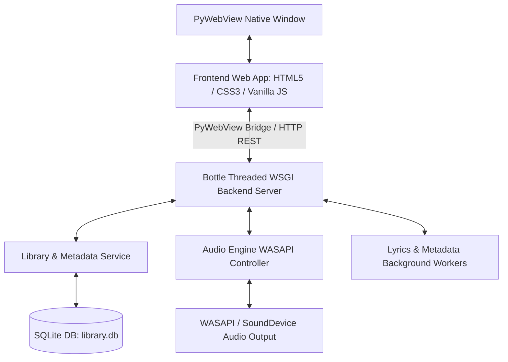

# ZFPlayer Architecture & Technical Documentation 📑

Tài liệu này mô tả chi tiết kiến trúc hệ thống, luồng dữ liệu (Data Flow), các giải pháp kỹ thuật cốt lõi và thuật toán được triển khai trong ứng dụng **ZeroFLAC Player (ZFPlayer)**.

---

## 🏗️ 1. Tổng Quan Kiến Trúc (Architectural Overview)

ZFPlayer áp dụng mô hình kiến trúc **Client-Server lai trên Desktop (Hybrid Desktop Application)**:



### Nguyên lý hoạt động:
1. **Frontend (Presentation Layer):** Giao diện thuần Web (HTML5/CSS3/ES6 JS) với thiết kế Glassmorphic Apple-style. Quản lý trạng thái bằng luồng dữ liệu 1 chiều (State Store).
2. **Backend (Application Layer):** Khởi chạy bằng Python 3.11 với khung làm việc Bottle WSGI server đa luồng. Cung cấp cả giao thức PyWebView Native Bridge và REST HTTP API.
3. **Audio Subsystem:** Sử dụng C-libraries (`libsndfile`) thông qua `soundfile` và `sounddevice` để đọc và truyền trực tiếp tín hiệu PCM nguyên bản vào driver **Windows WASAPI**.

---

## 🔊 2. Phân Hệ Âm Thanh (Audio Subsystem Architecture)

Tệp cốt lõi: `backend/audio/engine.py`

### 2.1 Luồng Xử Lý Tín Hiệu PCM (PCM Signal Pipeline)
```
[File FLAC / WAV / MP3] 
        ↓ (SoundFile / Libsndfile C-Decoder)
[RAM Memory: Raw NumPy Array (int16/int32/float32)]
        ↓ (Volume Scaling & Playback Position Offset)
[SoundDevice OutputStream Callback]
        ↓ (Direct Windows WASAPI Shared Mode Output)
[Audio Hardware / DAC]
```

### 2.2 Đột phá Kỹ thuật & Tối ưu hóa:
- **Zero-Latency RAM Caching:** Bản nhạc khi được yêu cầu phát sẽ được giải mã nguyên bản toàn bộ vào RAM bằng NumPy Array. Giúp quá trình nhảy đoạn (Seek), lặp bài (Loop), và chỉnh âm lượng diễn ra tức thì với độ trễ 0ms.
- **Tự động căn chỉnh Bit-Depth:**
  - `PCM_16`: Đọc dưới dạng `int16` truyền trực tiếp.
  - `PCM_24`: Đọc dưới dạng `int32`, dịch bít `raw_data = raw_data << 8` để giữ nguyên dải động 24-bit gốc cho driver WASAPI 32-bit.
  - `PCM_32` / `FLOAT`: Đọc dưới dạng `float32` truyền thẳng tới DAC.
- **Audio Stream Callback:** Callback đa luồng chống trễ (Non-blocking audio callback) đọc khối khung hình (frames) chính xác theo tần số lấy mẫu (Sample Rate) của file.

---

## 🗄️ 3. Cơ Sở Dữ Liệu & Tìm Kiếm (Database & Search)

Tệp cốt lõi: `backend/storage/database.py` & `backend/services/library_service.py`

### 3.1 Sơ đồ Cơ sở dữ liệu (SQLite Schema)

#### Bảng `tracks`
- `id` (INTEGER PRIMARY KEY)
- `path` (TEXT UNIQUE) - Đường dẫn tệp nhạc
- `title`, `artist`, `album`, `genre` (TEXT)
- `duration` (FLOAT) - Thời lượng bài hát tính bằng giây
- `samplerate`, `bitrate`, `channels`, `bits_per_sample` (INTEGER) - Thông số Kỹ thuật Hi-Res
- `cover_hash` (TEXT) - Mã băm ảnh bìa album để lưu cache
- `mtime` (INTEGER) - Thời gian sửa đổi file
- `last_played` (INTEGER) - Nhãn thời gian nghe gần nhất
- `is_liked` (INTEGER) - Trạng thái thả tim (0 hoặc 1)

#### Bảng `playlists` & `playlist_tracks`
- Quản lý danh sách phát tùy chỉnh của người dùng và thứ tự bài hát.

### 3.2 Tối ưu chỉ mục (Indexing Optimization)
- Tạo chỉ mục `idx_tracks_last_played` trên trường `last_played DESC` giúp truy vấn danh sách 20 bài hát nghe gần đây ở Trang chủ chỉ mất < 1ms.
- Tạo chỉ mục `idx_tracks_title_artist` cho tìm kiếm bài hát siêu tốc.

---

## 💻 4. Kiến Trúc Frontend & Thuật Toán Giao Diện

### 4.1 Hệ Thống Quản Lý Trạng Thái (Central State Store)
Tệp cốt lõi: `frontend/js/store.js`

Sử dụng mô hình Publisher/Subscriber nguyên bản:
```javascript
store.setState({ currentTrack: newTrack, isPlaying: true });
```
Mỗi khi state thay đổi, các Subscriber tương ứng (PlayerController, LibraryManager, HomeManager, LyricsController) sẽ nhận được thông báo để cập nhật UI cục bộ một cách trơn tru, không re-render lại toàn bộ DOM.

---

### 4.2 Thuật Toán Danh Sách Ảo (VirtualList Engine)
Tệp cốt lõi: `frontend/js/library.js`

Để hiển thị hàng chục nghìn bài hát mà vẫn duy trì 60fps, ZFPlayer tự xây dựng bộ thuật toán `VirtualList`:

#### Công thức tính toán vị trí hiển thị (Offset-aware Index Math):
```javascript
const offsetTop = this.scroller ? this.scroller.offsetTop : 0;
const trackScrollTop = Math.max(0, this.scrollTop - offsetTop);
const startIndex = Math.max(0, Math.floor(trackScrollTop / this.itemHeight) - 3);
const endIndex = Math.min(this.totalItems - 1, Math.ceil((trackScrollTop + this.container.clientHeight) / this.itemHeight) + 3);
```

#### Giải thích thuật toán:
1. `scroller.offsetTop`: Khoảng cách từ đầu khung chứa đến vị trí bắt đầu danh sách bài hát (qua khỏi ảnh bìa Playlist ~300px và dòng tiêu đề cột 48px).
2. `trackScrollTop`: Điểm cuộn thực tế **bên trong** danh sách bài hát.
3. Việc trừ `offsetTop` giúp thuật toán `VirtualList` không bao giờ bị tính nhầm số bài hát đã trôi qua khi cuộn qua ảnh bìa, ngăn chặn triệt để lỗi xuất hiện khoảng trống (blank gap) màu đen.

---

### 4.3 Hệ Thống Thiết Kế Glassmorphism (CSS Glass Tokens)
Tệp cốt lõi: `frontend/css/main.css` & `library.css`

#### Tokens Màu sắc & Độ trong suốt:
- `--bg-primary`: `rgba(255, 255, 255, 0.03)`
- `--bg-secondary`: `rgba(255, 255, 255, 0.04)`
- `--bg-elevated`: `rgba(255, 255, 255, 0.08)`
- `--bg-highlight`: `rgba(255, 255, 255, 0.15)`
- `--text-primary`: `#FFFFFF` (Trắng thuần 100%)
- `--text-secondary`: `rgba(255, 255, 255, 0.7)`

#### Hiệu ứng Hào quang (Dreamy Glow Typography):
- **Active State:** `text-shadow: 0 0 10px rgba(255, 255, 255, 0.4);`
- **Popup & Modals:** `backdrop-filter: blur(40px) saturate(1.5);` với viền phản quang `border: 1px solid rgba(255, 255, 255, 0.1)`.
- **Sticky Column Header:** `position: sticky; top: 0; backdrop-filter: blur(20px); background: rgba(0, 0, 0, 0.4); z-index: 10;`. Căn chỉnh cột theo lưới CSS Grid `40px 6fr 4fr 3fr 40px 40px 80px`.

---

## 🛠️ 5. Bảo Trì & Quy Trình Phát Triển (Maintenance Guide)

### 5.1 Cache Invalidation Strategy
Tất cả các tài nguyên tĩnh CSS/JS trong `frontend/index.html` đều được gắn tham số cache buster (Ví dụ: `main.css?v=20`). Khi chỉnh sửa bất kỳ file frontend nào, chỉ cần tăng giá trị `?v=N` thêm 1 đơn vị để đảm bảo trình duyệt pywebview không dùng lại cache cũ.

### 5.2 Lệnh Đẩy Code Nhanh (Git Workflow)
Khi thực hiện xong bất kỳ thay đổi nào, bạn chỉ cần gõ yêu cầu **"upgit"** hoặc yêu cầu đẩy code, Agent sẽ tự động:
1. Ghi nhận nhật ký phát triển vào `DEV_LOG.md`.
2. Tạo commit local dạng Conventional Commits.
3. Đẩy trực tiếp lên kho remote `https://github.com/zenny126/ZFPlayer.git`.
